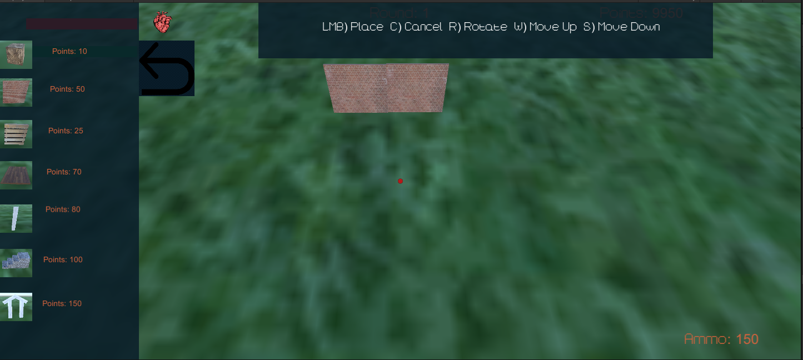
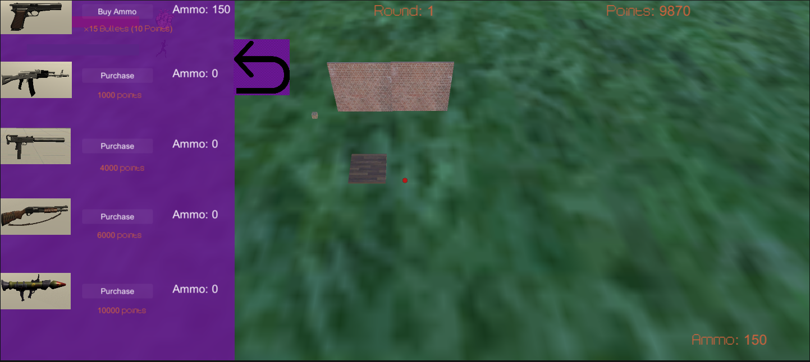
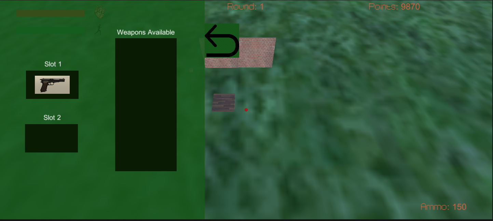
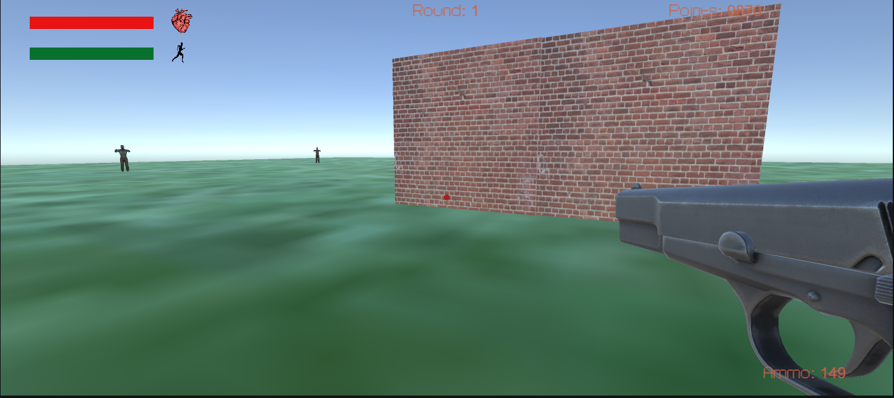

# Z-Defence
A 3D zombie survival shooter made with Unity. 

Gun Models:
  - Submachine Gun provided by 1nfern0
  - Rocket Launcher provided by BigRookGames
  - Assault Rifle provided by Creation Wasteland
  - Shotgun provided by Thiago3D
  
Zombie model provided by Pxltiger

##Building:

At the end of every round the player has the opportunity to spend their points building their base.

The camera switches from a first person view to a top down view where the player can use the side panel to select different objects to put in the scene.

Overtime the player can build up their base to help them fend off zombies.

##Armory:

This is where the player can purchase guns and ammo.

After they purchase the gun they have to equip in in the loadout menu if they want to use it.

##Loadout:

This is where the player can customize what weapons they take into the round.

You cannot change the loadout mid round so it is important that you choose the right weapons

##Gameplay:

The rounds last until all the zombies are killed or the player dies.

The player can run and jump and of course shoot their weapon.

How long the player survives depends on their preparation and instinct.

